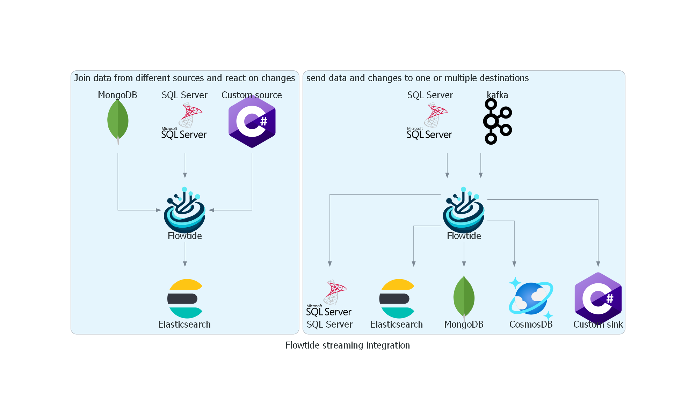
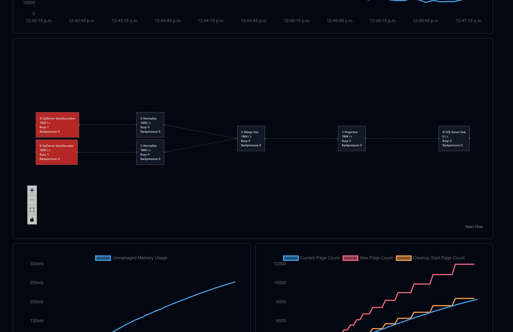

<br />
<p align="center">
  
  <h1 align="center">Flowtide.NET</h1>

  <p align="center">
    Streaming integration engine
  <br />
    <a href="https://koralium.github.io/flowtide/docs/intro"><strong>Explore the docs »</strong></a>
  </p>
</p>


**Flowtide** is a data streaming and integration engine designed for efficient real-time data processing and data materialization/denormalization. It stands out by focusing on correctness at time points (ensuring no missing values in joins for instance), versatile connector support, SQL language support for data streams and integrations, iteration/recursion support, and high-performance operations among other features. Flowtide is tailored for developers and companies looking to efficiently handle complex data transformations and integrations.



## Key Features

- **Differential Data Computation**: Processes data changes differentially, enabling the construction of the current state at any given time.
- **Versatile Connector Support**: Ready-built connectors are available for databases such as SQL Server, MongoDB, CosmosDB, Elasticsearch, etc., with the possibility to build your own connectors.
- **SQL Language Support**: Write your data streams and integrations using SQL, making complex data handling accessible and manageable.
- **High-Performance Operations**: Supports various operations such as projection, filtering, joining, aggregation, and recursion, enabling complex data transformations.
- **Integrated Checkpointing System**: Features a custom storage solution with a built-in checkpointing system to ensure data integrity and support full rollback capabilities on failure.
- **Larger than RAM Support**: Writes data to temporary storage on disk to manage data streams larger than the system's memory.
- **Materialize Data**: Easily materialize data from one or multiple sources into a destination, enabling architectures such as CQRS.
- **Vector Clock Watermark System**: Notifies when rows from the source system have been processed by the stream, informing users when the data has been transferred.

## UI for easy monitoring

Flowtide exposes all its metrics using .NET [Meter](https://learn.microsoft.com/en-us/dotnet/api/system.diagnostics.metrics.meter?view=net-9.0).
So it is possible to build grafana dashboards or use the built-in UI to visualize your stream.



## Getting started

To get started with Flowtide, the easiest way is to create a new C# project. This guide will show an example with SQL Server, but you can change
to another connector as well.

Create a minimal API AspNetCore application and install the following nuget package:

* FlowtideDotNet.AspNetCore
* FlowtideDotNet.Connector.SqlServer

## Writing the SQL code

The first step is to create an execution plan, this can be be done with any substrait plan creator.
But it is also possible to do it with SQL inside flowtide. This tutorial will show you how to create a plan with SQL.

```csharp
var sqlText = @"
INSERT INTO {sqlserver database name}.{schema name}.{destinationname}
SELECT t.val FROM {sqlserver database name}.{schema name}.{tablename} t
LEFT JOIN {sqlserver database name}.{schema name}.{othertablename} o
ON t.val = o.val
WHERE t.val = 123;
";
```

Replace all values with that are between \{ \} with your own table names in your SQL Server.

## Configure the stream

Next we will add a Flowtide stream to the service collection and add our SQL text as a execution plan:

```csharp
builder.Services.AddFlowtideStream("myStream)
  .AddSqlTextAsPlan(sqlText)
```

The stream name is added on all logs and metrics, so keeping it unique in your environment can help when setting up monitoring.

## Add connectors

So far we have written SQL code and started configuring the stream. But we have not yet instructed Flowtide what it should connect to.
Some examples of sinks and sources are:

* MS SQL
* Kafka
* Elasticsearch
* And more

This is done by using the *AddConnectors* method:

```csharp
builder.Services.AddFlowtideStream("myStream)
  ...
  .AddConnectors(connectorManager => {
    // Add a SQL Server database as an available source
    connectorManager.AddSqlServerSource(() => "Server={your server};Database={your database};Trusted_Connection=True;");
    // Add another SQL Server database as a sink
    connectorManager.AddSqlServerSink(() => "Server={your server};Database={your database};Trusted_Connection=True;");
  })
```

## Configuring state storage

A Flowtide stream requires state storage to function. This can be stored on a file system or on a cloud storage solution.

In this tutorial we will use a local development storage. This storage gets cleared between each test run which make it good for development.

```csharp
builder.Services.AddFlowtideStream("myStream)
  ...
  .AddStorage(storage => {
    storage.AddTemporaryDevelopmentStorage();
  });
```

If you want to use persistent storage on the local file system, you can instead use:

```csharp
.AddStorage(storage => {
  storage.AddFasterKVFileSystemStorage("./stateData");
});
```

## Adding the UI

If you want to add the UI to visualize the progress of the stream, add the following code after "var app = builder.Build();".

```
app.UseFlowtideUI("/stream");
```

## Full example

Here is the full code example to get started:

```csharp
var builder = WebApplication.CreateBuilder(args);

var sqlText = @"
INSERT INTO {sqlserver database name}.{schema name}.{destinationname}
SELECT t.val FROM {sqlserver database name}.{schema name}.{tablename} t
LEFT JOIN {sqlserver database name}.{schema name}.{othertablename} o
ON t.val = o.val
WHERE t.val = 123;
";

builder.Services.AddFlowtideStream("myStream)
  .AddSqlTextAsPlan(sqlText)
  .AddConnectors(connectorManager => {
    // Add a SQL Server database as an available source
    connectorManager.AddSqlServerSource(() => "Server={your server};Database={your database};Trusted_Connection=True;");
    // Add another SQL Server database as a sink
    connectorManager.AddSqlServerSink(() => "Server={your server};Database={your database};Trusted_Connection=True;");
  })
  .AddStorage(storage => {
    storage.AddTemporaryDevelopmentStorage();
  });

var app = builder.Build();
app.UseFlowtideUI("/stream");

app.Run();
```