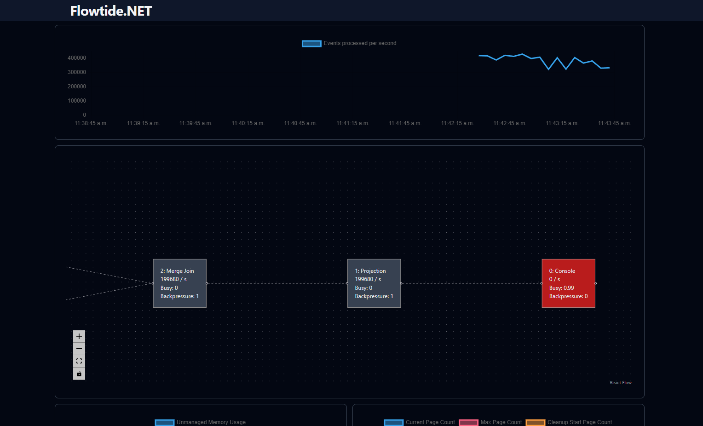

## Major Changes

### Column-Based Event Format

Most operators have transitioned from treating events as rows with flexbuffer to a column-based format following the Apache Arrow specification. This change has led to significant performance improvements, especially in the merge join and aggregation operators. Transitioning from row-based to column-based events involved a major rewrite of core components, and some operators still use the row-based format, which will be updated in the future.

Not all expressions have been converted to work with column data yet. However, the solution currently handles conversions between formats to maintain backward compatibility. Frequent conversions may result in performance decreases.

The shift to a column format also introduced the use of unmanaged memory for new data structures, for the following reasons:

* 64-byte aligned memory addresses for optimal SIMD/AVX operations.
* Immediate memory return when a page is removed from the LRU cache, instead of waiting for the next garbage collection cycle.

With unmanaged memory, it is now possible to track memory allocation by different operators, providing better insight into memory usage in your stream.

### B+ Tree Splitting by Byte Size

Previously, the B+ tree determined page sizes based on the number of elements, splitting pages into two equal parts when the max size (e.g., 128 elements) was reached. While this worked for streams with uniform element sizes, it led to size discrepancies in other cases, affecting serialization time and slowing down the stream.

This update introduces page splitting based on byte size, with a default page size of 32KB, ensuring more consistent and predictable page sizes.

### Initial SQL Type Validation

This release contains the beginning of type validation when creating a Substrait plan using SQL. Currently, only SQL Server provides specific type metadata, while sources like Kafka continue to designate columns as 'any' due to varying payload types.

The new validation feature raises exceptions for type mismatches, such as when a boolean column is compared to an integer (e.g., boolColumn = 1). This helps inform users transitioning from SQL Server that bit columns are treated as boolean in Flowtide.

### New UI

A new UI has been developed, featuring an integrated time series database that enables developers to monitor stream behavior over time. This database’s API aligns with Prometheus standards, allowing for custom queries to investigate potential issues.

The UI retrieves all data through the Prometheus API endpoint, enabling future deployment as a standalone tool connected to a Prometheus server.

## Minor Changes

### Congestion Control Based on Cache Misses

Flowtide processes data in small batches, typically 1-100 events. While this approach works well with in-memory data, cache misses that require persistent storage access can create bottlenecks. This is particularly problematic with multiple chained joins, where sequential data fetching can delay processing.

To address this, the join operator now monitors cache misses during a batch and, when a threshold is reached, splits the processed events and forwards them to the next operator. This change allows operators to access persistent storage in parallel, easing congestion.

### Reduce the amount of pages written to persistent storage

Previously, all B+ tree metadata was written to persistent storage at every checkpoint, including root page IDs. In streams with numerous operators, this led to unnecessary writes.

Now, metadata is only written if changes have occurred, reducing the number of writes and improving storage efficiency.