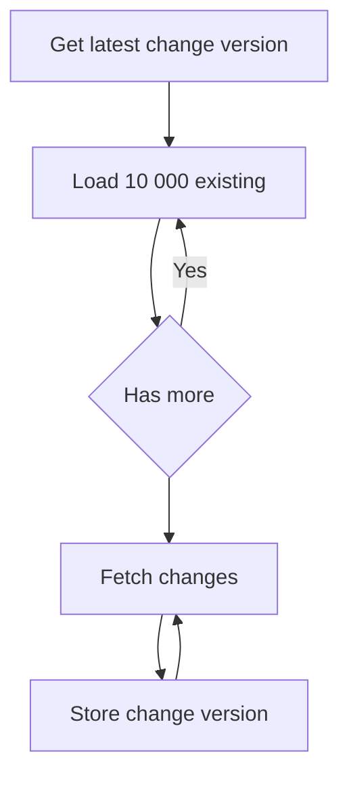

# SQL Server Connector

The SQL Server connector has three different parts:

* **Source** - Reads data from a SQL Server table.
* **Sink** - Writes results from a stream into a SQL Server table.
* **Table Provider** - Provides table information to the SQL plan builder.

## Supported Data Types

The *SQL Server connector* supports reading and writing the following data types:

* Int
* BigInt
* Binary
* Bit
* Char
* Date
* Datetime
* Datetime2
* Decimal
* Float
* Image
* Money
* Nchar
* Ntext
* Numeric
* Nvarchar
* Real
* Smalldatetime
* Smallint
* Text
* Time
* Tinyint
* Uniqueidentifier
* Varbinary
* Varchar
* Xml

## Source

The SQL Server Source allows Flowtide to fetch rows and upates from a SQL Server table.

> [!NOTE]
> It's strongly recommended that change tracking is enabled on the targeted tables. And must be enabled to allow near-realtime streaming.


The source uses the following logic to fetch data into the stream:



### Reading with change tracking
To configure a source for a table with change tracking:
```csharp
connectors.AddSqlServerSource(() => "connectionstring");

connectors.AddSqlServerSource(new SqlServerSourceOptions
{
    ConnectionStringFunc = () => "",
});
```

By default changes are fetched once per second and can be modified using the `DeltaLoadInterval` option.

### Reading without change tracking
Flowtide can read data from sources that do not have change tracking enabled. For these sources data are all data is fetched on an interval, specified with the `FullReloadInterval` option on the source.

> [!WARNING]
> Note that changes are not directly caught when change tracking is disabled.


#### Reading from views
To allow  from sql server views the following options must be set:

```csharp
connectors.AddSqlServerSource(new SqlServerSourceOptions
{
    ConnectionStringFunc = () => "",
    EnableFullReload = true,
    FullReloadInterval = TimeSpan.FromHours(24),
});
```

This will read all data from the view on an interval specified. Delta loading data is not enabled when targeting a view.

#### Reading from tables
When targeting a table that does not have change tracking enabled an additional option must be provided `AllowFullReloadOnTablesWithoutChangeTracking`.

```csharp
connectors.AddSqlServerSource(new SqlServerSourceOptions
{
    ConnectionStringFunc = () => "",
    EnableFullReload = true,
    FullReloadInterval = TimeSpan.FromHours(24),
    AllowFullReloadOnTablesWithoutChangeTracking = true
});
```

This will read all data from the table on an interval specified in `FullReloadInterval`. Delta loading data is not enabled when targeting a table without change tracking.

> [!NOTE]
> If the table supports change tracking, delta loading will still be used even if these options are provided. But a full load will occur on the provided interval.


#### Reading from large views or tables without change tracking

When targeting a large view or table it's possible to control the allowed size (number of rows) with the `FullLoadMaxRowCount` option. This default value is 1 000 000 rows.

### Retry strategy (reading from SQL Server)

By default the SQL Server source has a default retry strategy that will retry up to 10 times with increasing intervals, totaling a period of ~16 minutes. 
If no successful connection could be made during this period the stream will be restarted.

A custom pipeline can be specified on the source by setting the `ResiliencePipeline` property.
```csharp
connectors.AddSqlServerSource(new SqlServerSourceOptions
{
    ResiliencePipeline = myPipeline
});
```
Flowtide uses `polly` to handle retries, documentation and examples can be found here: [Polly](https://github.com/App-vNext/Polly).

## Sink

The *SQL Server Sink* implements the *grouped write operator*. This means that all rows are grouped by a primary key, thus all
sink tables must have a primary key defined.

> [!NOTE]
> All SQL Server Sink tables must have a primary key defined. The primary key must also be in the query that fills the table.


Its implementation waits fully until the stream has reached a steady state at a time T until it writes data to the database.
This means that its table output can always be traced back to a state from the source systems.

To use the *SQL Server Sink* add the following line to the *ConnectorManager*:

```csharp
connectorManager.AddSqlServerSink(() => connectionString);
```

As with the *SQL Server Source*, the connection string is returned by a function to enable dynamic connection strings.

The sink inserts data into *SQL Server* by creating a temporary table, which follows the table structure of the destination with an added operation metadata column.
The data is inserted into the temporary table using *Bulk Copy*. This allows for fast binary insertion into the temporary table.

After data has been inserted into the temporary table, a merge into statement is run that merges data into the destination table.
After all data has been merged, the temporary table is cleared of all data.

> [!WARNING]
> If there are multiple rows in the result with the same primary key, only the latest seen row will be inserted into the destination table.


### Custom Primary Keys

In some scenarios you may want to override the table's primary keys or the table might not have a primary key configured.
In this scenario you can declare the columns that Flowtide should use as primary keys in the insert statement:

```sql
INSERT INTO [my-db].[dbo].[my-table] PRIMARY KEY ([my_column1], [my_column2])
SELECT my_column1, my_column2, my_column3 FROM ...
```

The declared columns must all be written by the statement. To learn more, visit the [Insert Into docs](../sql/insertinto.md).

> [!NOTE]
> The `CustomPrimaryKeys` option on `SqlServerSinkOptions` does the same thing and is still honored, but it is obsolete.
> It applies the same keys to every table the sink handles, so it cannot be used by a stream that writes to more than one
> table. When both are given, the keys declared in the statement are used.
>
> ```csharp
> connectorManager.AddSqlServerSink(new SqlServerSinkOptions() {
>   ConnectionStringFunc = () => connectionString,
>   CustomPrimaryKeys = new List<string>() { "my_column1", "my_column2" }
> });
> ```

### Sink hooks

The sink exposes a set of hooks on `SqlServerSinkOptions` that allow adding custom logic around the bulk copy
and the merge into statement.

| Option                          | required | default | Description                                                                     |
| :------------------------------ | :------: | :-----: |:------------------------------------------------------------------------------- |
| CustomBulkCopyDestinationTable  |  false   |         | Selects a table to bulk copy into instead of a temporary table. No merge into is run. |
| OnDataTableCreation             |  false   |         | Hook that is run when the data table is created, allows adding extra columns.   |
| ModifyRow                       |  false   |         | Hook that is run for each row, allows setting the extra columns.                |
| OnDataUploaded                  |  false   |         | Hook that is run after a batch has been uploaded.                               |
| OnInitialize                    |  false   |         | Hook that is run when the sink is initializing.                                 |
| OnCheckpointComplete            |  false   |         | Hook that is run after the stream has durably committed a checkpoint.           |

Every hook is passed the name of the table that is bulk copied into and the destination table name as a list of
name parts. A stream can write to several tables with a single `SqlServerSinkOptions`, so these arguments are how a
hook tells the destinations apart.

> [!NOTE]
> `OnInitialize` is called again every time the stream restarts, so its logic must be safe to run more than once.
> The destination table, and any table returned by `CustomBulkCopyDestinationTable`, must already exist, their
> schemas are read before the hook runs.

### The checkpoint id

`ModifyRow`, `OnDataUploaded` and `OnInitialize` are all given a `checkpointId`. It is the *SQL Server*
sink's view of the Flowtide checkpoint version that the rows belong to, and it is stable in the way a
stored column needs to be:

* It is **reused when the stream rolls back**. If a checkpoint fails and Flowtide replays the epoch, the
  replayed rows carry the same id as the rows written before the failure. That makes it usable as a key
  for overwriting or cleaning up replayed data.
* It is **not a wall clock time**. It is the state manager checkpoint version, a counter that advances by
  one per committed checkpoint.

Which checkpoint the id refers to depends on the execution mode:

| ExecutionMode | Rows are uploaded | The `checkpointId` is |
| :------------ | :---------------- | :-------------------- |
| `OnCheckpoint` | Inside the checkpoint | The checkpoint that is about to make the rows durable |
| `OnWatermark` | Between checkpoints, on each watermark | The checkpoint that will commit the rows next |
| `Hybrid` (default) | Inside the checkpoint for the initial data, on watermarks after that | Either of the above, depending on which phase the stream is in |

`OnInitialize` receives the id that the first upload of the run will use, so it can be compared against
ids that `ModifyRow` stored in a previous run.

> [!NOTE]
> The version is only durable if the stream uses a durable state storage. With the default in-memory
> development storage the counter restarts from 1 on every process start, which is consistent with that
> storage replaying the whole stream from scratch, but means the ids repeat across restarts.

### Example writing to a custom table

`CustomBulkCopyDestinationTable` writes the data into a table you control instead of a temporary table, and skips
the merge into statement. Returning *null* leaves that destination to the default behaviour, which makes it possible
to only take over some of the tables a stream writes to:

```csharp
connectorManager.AddSqlServerSink(new SqlServerSinkOptions()
{
    ConnectionStringFunc = () => connectionString,

    // only take over 'orders', all other tables use a temporary table and merge into
    CustomBulkCopyDestinationTable = (destinationTable) =>
        destinationTable[^1] == "orders" ? "dbo.orders_staging" : null,

    // add a column that does not exist in the destination table
    OnDataTableCreation = (dataTable, bulkCopyTable, destinationTable) =>
    {
        dataTable.Columns.Add("md_checkpoint");
        return ValueTask.CompletedTask;
    },

    // fill the column for each row
    ModifyRow = (row, isDeleted, watermark, checkpointId, isInitialData, bulkCopyTable, destinationTable) =>
    {
        row["md_checkpoint"] = checkpointId;
    },

    // run the merge into logic yourself after each batch
    OnDataUploaded = async (connection, watermark, checkpointId, isInitialData, bulkCopyTable, destinationTable) =>
    {
        using var command = connection.CreateCommand();
        command.CommandText = $"EXEC merge_orders @staging = '{bulkCopyTable}'";
        await command.ExecuteNonQueryAsync();
    },

    // clear out rows left behind by a previous run
    OnInitialize = async (connection, checkpointId, bulkCopyTable, destinationTable) =>
    {
        using var command = connection.CreateCommand();
        command.CommandText = $"DELETE FROM {bulkCopyTable}";
        await command.ExecuteNonQueryAsync();
    }
});
```

> [!NOTE]
> When a custom table is used, the operation metadata column that tells an upsert from a delete is not added.
> If your merge logic needs it, add the column in `OnDataTableCreation` and set it in `ModifyRow` from the
> `isDeleted` argument.

### Exactly once with a two phase commit

`OnCheckpointComplete` runs after the stream has durably committed a checkpoint, and in a distributed stream
only once every substream has committed it. Everything the sink uploaded for that checkpoint is already
written at that point and the stream will not roll back past it, which makes the hook the commit phase of a
two phase commit:

1. **Prepare.** The sink bulk copies rows into a staging table during the checkpoint. Tag each row with the
   `checkpointId` in `ModifyRow` so it is known which checkpoint the row belongs to.
2. **Commit.** `OnCheckpointComplete` runs once the checkpoint is durable. Move the rows tagged with that
   `checkpointId` into the destination table.
3. **Recover.** `OnInitialize` is given the last committed checkpointId. Commit anything **staged** with a
   lower or equal id, since the commit hook may never have run for it, and discard the rest of the staging
   table.

Step 3 is not optional. `OnCheckpointComplete` is never called again for a checkpoint it missed, and it does
not run on a graceful stop at all, so the reconciliation is the only thing that commits those rows.

#### Rolling back past a commit

In a stream running normally, including a distributed one, this cannot happen. Substreams pair their
checkpoint cycles one to one: a substream will not consume a peer's barrier without pairing it to a local
checkpoint, and each committed version produces exactly one acknowledgement. The compaction step is
therefore reached only once every substream has durably committed that same checkpoint, which is why the
commit hook runs from there rather than from the checkpoint completion notification.

There is one exception, and it is narrow. A substream that is shutting down runs a stop drain cycle every
25 ms until its drain finishes, and each of those commits a version and acknowledges it, while the receiving
side only needs the first stop barrier. The extra acknowledgements are real, and they can let a later cycle
on the other substream complete slightly early. If that shutting down substream then fails rather than
stopping cleanly, the stream can roll back below a version the other substream already committed, leaving
rows for that epoch in the destination table.

Usually nothing extra is needed even then. The write operator's own output state rolls back with the stream,
so after the rollback every key touched since the restored checkpoint is sent to the sink again. A commit
that upserts and deletes by primary key, which is the normal shape for this sink, simply overwrites those
rows on the replay.

It only needs handling when the commit is not idempotent under a replay, for example an append only insert
or an `INSERT ... WHERE NOT EXISTS` that skips rows already present. In that case store the `checkpointId`
alongside the committed rows, and delete the rows above the last committed id in `OnInitialize` before the
replay writes them again. The checkpoint version is reused after a rollback, so the replayed epoch writes
the same ids and the result converges.

> [!WARNING]
> The commit must be idempotent. It is redone whenever the stream cannot tell that it already ran, which
> happens on more than the obvious crash, see below.

> [!WARNING]
> This only works with `ExecutionMode.OnCheckpoint` together with `CustomBulkCopyDestinationTable`.
> In the other execution modes rows are uploaded between checkpoints, so there is no well defined set of
> rows belonging to a checkpoint, and the default temporary table path merges into the destination table
> while it uploads, which leaves nothing to commit.

#### The commit must be idempotent

`OnCheckpointComplete` itself runs at most once per checkpoint, but the work it does can be repeated:

* If the commit writes the destination table and clears the staging rows as separate statements, a stop
  between them leaves both, and the reconciliation in `OnInitialize` commits those rows a second time.
* The reconciliation runs on every start, including a start that follows a completely clean run.
* A rolled back epoch is replayed and committed again under the same `checkpointId`.
* A commit that is interrupted part way through is redone from the start.

Put the destination write and the staging cleanup in one transaction, so the first case cannot happen at
all, and make the destination write itself idempotent, with a `MERGE` on the primary key or an
`INSERT ... WHERE NOT EXISTS`, so the remaining cases converge.

Both hooks commit the same way, they only differ in how far they commit, so write the commit once and call
it from both. That is also what keeps the recovery half from being forgotten:

```csharp
// Commits every staged row up to and including the given checkpoint. Idempotent, and the write and the
// staging cleanup are one transaction.
static async Task CommitUpTo(SqlConnection connection, long checkpointId)
{
    using var command = connection.CreateCommand();
    command.CommandText = "EXEC commit_orders @upTo";
    command.Parameters.AddWithValue("@upTo", checkpointId);
    await command.ExecuteNonQueryAsync();
}

connectorManager.AddSqlServerSink(new SqlServerSinkOptions()
{
    ConnectionStringFunc = () => connectionString,
    ExecutionMode = ExecutionMode.OnCheckpoint,
    CustomBulkCopyDestinationTable = (destinationTable) => "dbo.orders_staging",

    OnDataTableCreation = (dataTable, stagingTable, destinationTable) =>
    {
        dataTable.Columns.Add("md_checkpoint", typeof(long));
        return ValueTask.CompletedTask;
    },

    // 1. prepare, tag every staged row with the checkpoint it belongs to
    ModifyRow = (row, isDeleted, watermark, checkpointId, isInitialData, stagingTable, destinationTable) =>
    {
        row["md_checkpoint"] = checkpointId;
    },

    // 2. commit, only reached once the stream has committed the checkpoint
    OnCheckpointComplete = (connection, checkpointId, stagingTable, destinationTable) =>
        new ValueTask(CommitUpTo(connection, checkpointId)),

    // 3. recover, redo any commit that was lost, then drop what belongs to a rolled back epoch
    OnInitialize = async (connection, checkpointId, lastCommittedCheckpointId, stagingTable, destinationTable) =>
    {
        await CommitUpTo(connection, lastCommittedCheckpointId);

        using var command = connection.CreateCommand();
        command.CommandText = $"DELETE FROM {stagingTable} WHERE [md_checkpoint] > @lastCommitted";
        command.Parameters.AddWithValue("@lastCommitted", lastCommittedCheckpointId);
        await command.ExecuteNonQueryAsync();
    }
});
```

> [!NOTE]
> Only the discard in step 3 is specific to recovery. Staged rows above the last committed checkpoint belong
> to an epoch that was rolled back, and they must not be removed on the `OnCheckpointComplete` path, where a
> later epoch may already be staging.

> [!NOTE]
> `OnCheckpointComplete` runs on the stream's checkpoint thread rather than the operator thread, so it is
> given its own connection instead of the one the sink uploads with. A session scoped temporary table is
> therefore not visible inside the hook, which is another reason the pattern needs a real staging table.

> [!NOTE]
> The hook deliberately runs from the stream's compaction step rather than from the checkpoint completion
> notification. A distributed stream rolls its substreams back to the lowest version they all share, which
> can be lower than a version a single substream already committed on its own. Compaction is reached only
> after every substream acknowledged the checkpoint, so it is the first point where committing to an
> external system is safe.

## SQL Table Provider

The SQL table provider is added to the *SQL plan builder* which will try and look after used tables in its configured *SQL Server*.
It provides metadata information about what the column names are in the table.

To use the *table provider* add the following line to the *Sql plan builder*:

```csharp
sqlBuilder.AddSqlServerProvider(() => connectionString);
```

If you are starting Flowtide with dependency injection, a table provider is added automatically, so this step is not required.